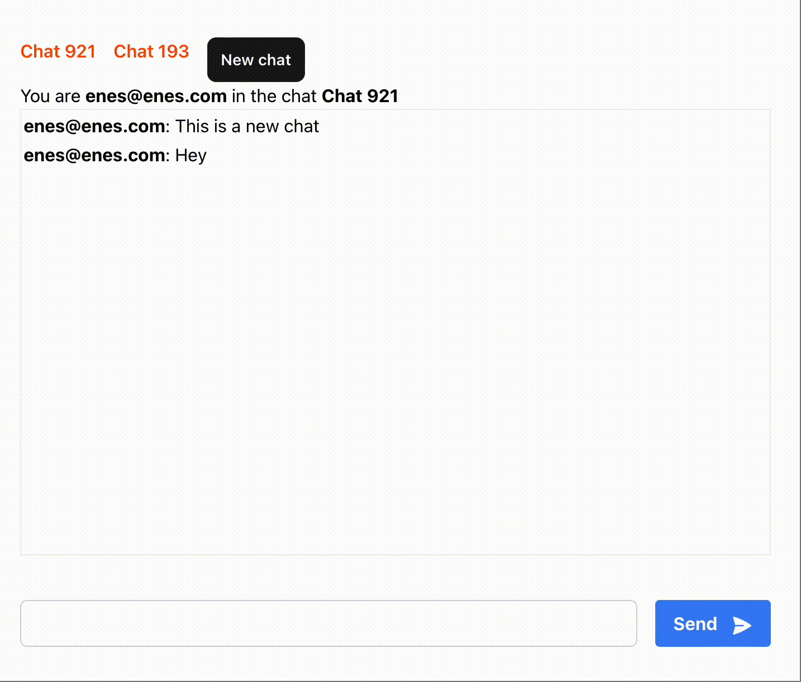

# QuickChat

A simple chat application built with Phoenix LiveView and Svelte. It also has authentication

#### Major problems

-   We got to create a general function called "convert_ecto_to_map" that will convert the ecto struct to a map. This is because the ecto struct cannot be passed into Svelte by default. Currently I have many functions like, "convert_message_to_map", "convert_user_to_map", "convert_chat_to_map", etc.

## Showcase

